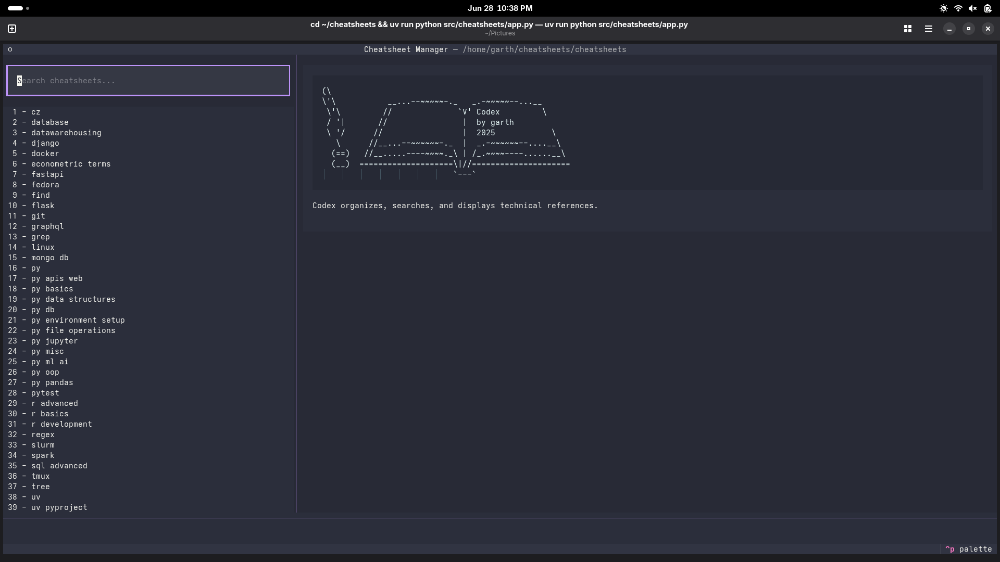
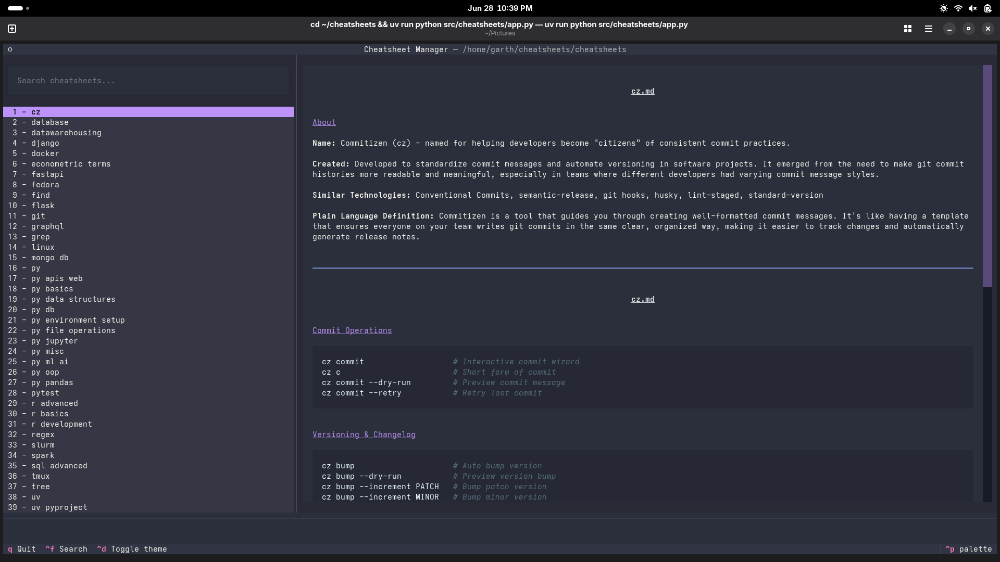
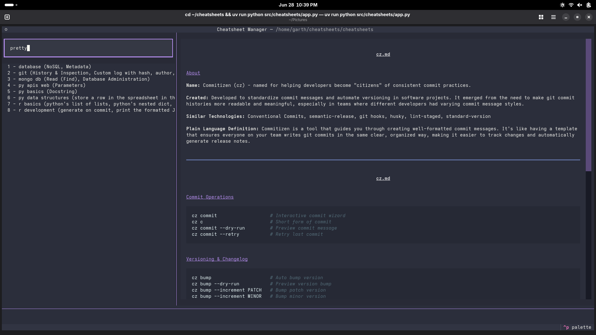

# Codex

Codex organizes, searches, and displays technical references.

```ascii
(\ 
\'\   
 \'\          __...--~~~~~-._   _.-~~~~~--...__
 / '|       //     codex     `V'               \\
 \ '/      //                 |                 \\
   \      //__...--~~~~~~-._  |  _.-~~~~~~--...__\\
  (==)   //__.....----~~~~._\ | /_.~~~~----.....__\\
  (__)  ====================\\|//====================
                            `---`
```

ASCII book by Donovan Bake.

## First Time Setup

1. clone:
   ```bash
   git clone https://github.com/garthmortensen/codex
   cd codex
   ```

1. install dependencies:
   ```bash
   uv pip install -r requirements.txt
   ```

1. for quick access, add alias to your shell (`.bashrc` or `.zshrc`):
   ```bash
   alias codex='cd ~/codex && uv run python src/codex/app.py'
   ```

## Use

1. Main screen contains 3 panes. Top left pane is the search bar. Left pane is list of all markdown files in program subdirectory. Right pane is splash screen image.


1. Select a cheatsheet to display content.


1. `Control-f` to search for text. Results will display in the below list.

